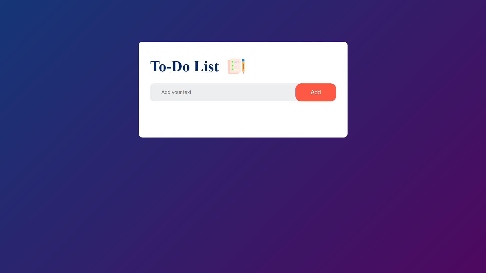
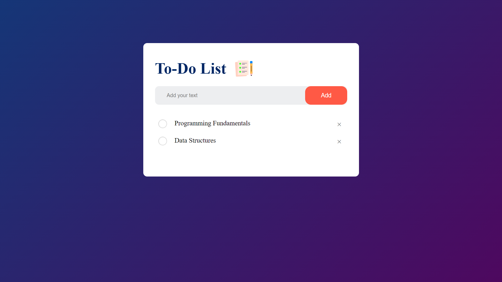
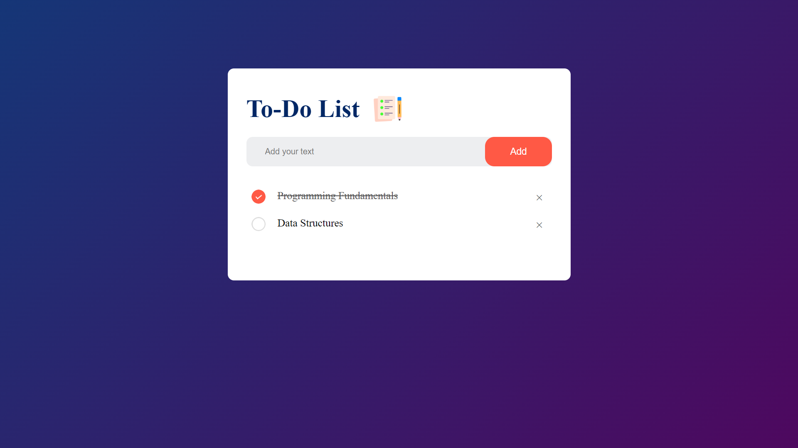

# To-Do List App

This is a simple To-Do List web application where users can add tasks to a list, mark them as completed, and remove them.

## Description
This To-Do List App is a straightforward and user-friendly tool to help you manage your tasks efficiently. With its intuitive interface, adding, completing, and removing tasks is a breeze. Whether you're organizing your daily chores, planning projects, or making a shopping list, this app has got you covered.

## Features

- Add Tasks: Quickly add tasks by typing in the input box and pressing Enter or clicking the "Add" button.
- Mark as Completed: Easily mark tasks as completed by clicking on them. Click again to undo.
- Remove Tasks: Remove unwanted tasks with a simple click on the delete icon (✕) next to them.
- Persistence: Your tasks are saved locally using the browser's `localStorage`, ensuring they persist even after refreshing the page or closing the browser.

## Technologies Used

- HTML
- CSS
- JavaScript

## Demo

## Add Task

## Complete Task

## Live Demo

https://github.com/Tashfeen-Chohan/JS-TO-DO-APP/assets/147094961/591b392d-dcf5-4f23-8dad-e75711fdb321

